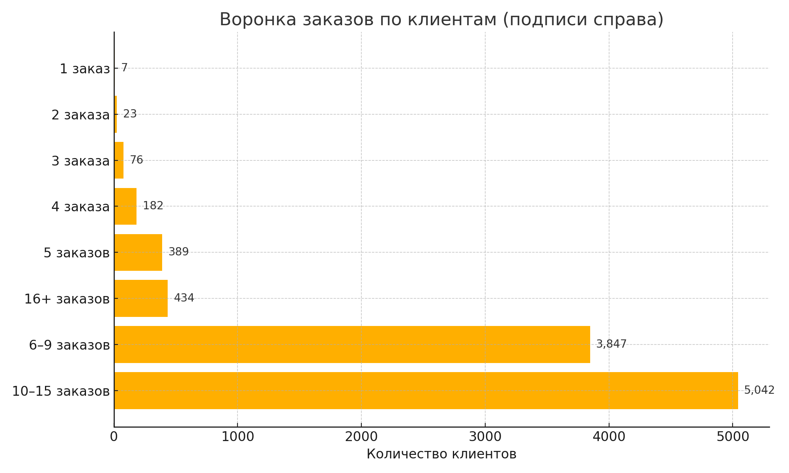

# 🔄 Customer Order Funnel — Ozon

## 📌 Цель проекта

Построить поведенческую воронку на основе количества заказов, совершённых клиентами маркетплейса Ozon.  
Анализ позволяет понять, сколько клиентов совершают один заказ, сколько — повторные, и как распределяются пользователи по стадиям активности.

## 📊 Что было сделано

- Вычислено количество заказов на каждого клиента
- На основе этих данных сформированы логические стадии воронки
- Посчитано количество клиентов в каждой стадии
- Построен график воронки с подписями значений

## 📈 Результаты

На графике представлена воронка, показывающая распределение клиентов по количеству заказов:

## 💬 Комментарии к графику

Интересно, что наибольшее количество клиентов находится не в начальных уровнях (1–2 заказа), как часто бывает, а в сегментах с 6–15 заказами.  
Это делает форму воронки визуально “обратной” классической.  
Такое поведение может быть связано с тем, что в выборке остались только активные клиенты, либо это отражает высокий уровень удержания в сервисе.

## 📂 Структура проекта

- `/sql/` — SQL-запрос для формирования стадий воронки  
- `/img/` — PNG-график с подписями  
- `/data/` — (опционально) пример исходных данных

## 📎 Технологии и инструменты

- SQLite (через DBeaver) — работа с данными  
- Excel — визуализация графика  
- GitHub — оформление проекта
